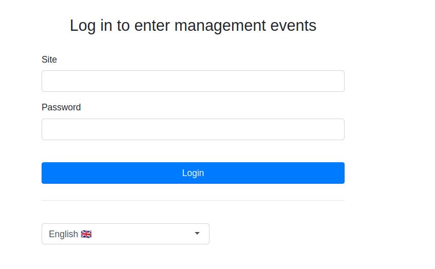
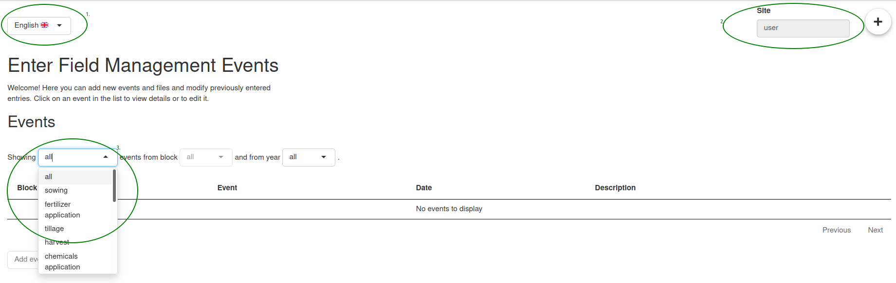
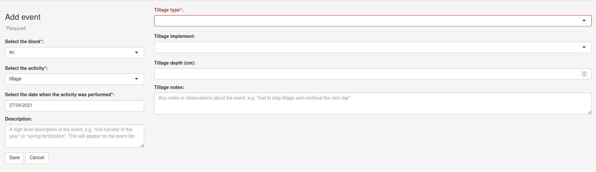

### Login
In order to use the application, you should have a site account registered. If you don’t have an account yet, see the contact section for requesting one, otherwise you should be able to fill in the provided sitename and password to login.

### Layout
The UI of the application is simple, but we will provide an overview of what functionalities and views the user can utilise.

1. Change the language between English and Finnish.
2. Check the sitename you have logged in with.
3. Change the shown subset of the events based on the type of events, block and year.

### Filling in events
Start filling in the management event information by first choosing the block wherein the event has occurred, the name of this activity/event and a date for when it was conducted. One may also provide a short description that will be visible in the event table and later on give a quick reminder to which occurrence the event was related.

After choosing the type of activity, one should fill in the data about this activity. Different types of activities have different fields to be filled in, for example, after choosing tillage one should fill in the type of tillage, how the tillage was implemented and what the depth of the tillage was.

Here are some notes that generally apply to all of the activities and that are good to keep in mind when filling in the form:

- Every event has to be logged in as its own event. In other words, even though some of the events can happen simultaneously and can in one’s mind be summarised as one event, it may require two or more records in application. For example tillage and sowing should be handled separately even in reality they happened simultaneously or back to back.

- Pay attention to the units and in which form the application wants the numeric values. Units can change within the same form as some fields may request for example kg/ha while other fields may require t/ha. However, the desired unit is stated in the field so guessing is not required. It also doesn’t matter if the decimal point is indicated with “.” or “,”, the application recognizes both practices.

- The application indicates with red border lines, if some required value is missing from the form. It is not usually required to fill in all of the fields and some of the fields may be difficult even for farmers to fill in. However, we hope that the user tries to fill in the events with care and as accurately as they are able to. This ensures that the data is valid for future usage in  research purposes.

- **Events can be modified after saving them**, so there is no need to stress about doing something irreversible.

### Purpose of the application
The application is created to collect data of the field management events in a uniform way. The data collected through this application is used in the ecosystem models with a purpose to simulate carbon and other greenhouse gas exchanges in the field. Field management events play a key role in estimating such matters in agricultural environments.

### Contact information

Henri Kajasilta      henri.kajasilta@fmi.fi      [Eng / Fin]  
Istem Fer              istem.fer@fmi.fi              [Eng]

You may contact us, if you are facing one or several of the following situations:

- Add (your) site to the application  
- Reset the site/user password  
- Report a possible bug in the application  
- You want to request a feature that is currently not available  
- You want to know more about the app

Regarding the new features and bug fixes, you can also fill in a github issue [**here**](https://github.com/Ottis1/fieldactivity/issues) without contacting us.
