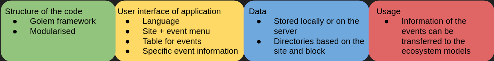

# Summary

The usability of models is crucially dependent on the available information that is given as an input to the model. Ecosystem models are not an exception here and can require input values e.g. from meteorological drivers, soil measurements or plant functional types in order to simulate fields properly from ecological point of view. These inputs may require continued measurements to provide a comprehensive picture of the field and are therefore usually automated to continuously gather data from the fields. Repeated measurements are especially required when we are doing near-term ecological forecasting and time-period is measured in years rather than decades[@dietze2018iterative]. However, in addition to these measurements, an essential part of field activity are the field management events, which would be difficult to measure automatically, but can rather easily be reported by humans. In agricultural sites field management events are frequently practised by farmers, when they are taking actions such as planting, fertilising or harvesting. These actions can be implemented several times in a year per site and bookkeeping of these events is equally important for models to function.

Field management events change significantly the properties of the field, which can in practice change the carbon cycle in that field for example. From modelling point of view, it is highly important to keep count from these field management activities and gather all of the information relating to these events that might be relevant for field simulations. To make the process even smoother and to save working hours, it is beneficial to report these activities in a specific form from which it is more applicable to transfer for the models to use.

In order to achieve coherent and sufficient data, we have developed a shiny application to aid bookkeeping of the field management events. The application is running on a server, which enables farmers and scientists to fill field management events easily and without any restrictions of location.

# Statement of need

Multiple farmers are testing different farming methods on their fields in Finland. These farming methods are taking place in the farms wherein there are also on-going measurements of data from atmosphere, vegetation and soil. The data is used in carbon cycle modelling and in order to have information of carbon sequestration in individual fields [@nevalainen2022towards]. Interest in this type of research can open more ways to mitigate climate change, if more carbon can be stored into the soils [@smith2020measure].

For researchers different ecological models are essential to determine the effect of different farming methods and how these methods can be utilised from the climate perspective. However, without the information of field management activities, we are not able to determine the state of the field correctly and consequently simulate carbon flux properly. Therefore we have developed fieldactivity to improve the logging of events into the system.

# Functionality

1) Application is created by following the Golem framework. It is made to be highly modularised, which helps in the application’s maintenance and development in the future.

2) Application provides an easy to use interface with two different language options (English and Finnish). Dropdown menus for sites, blocks and field management events prevents making any typing errors and saved input can be verified from the events’ table that is visibly for the user the whole time she uses the app.

3) Data will be stored initially locally, but application can be integrated to the server. Data will be separated to different directories based on the given site and block information. However, all of the events for the same site and block are stored into one .json-file.

4) Data inputs can differ based on the used ecosystem model, so it might be unavoidable to produce an event template that would suit all the models. Nevertheless, providing the information of field management events in a unanimous way with sufficient amount 

and referenced from text using \autoref{fig:4fields}.

# Citations

Citations to entries in paper.bib should be in
[rMarkdown](http://rmarkdown.rstudio.com/authoring_bibliographies_and_citations.html)
format.

If you want to cite a software repository URL (e.g. something on GitHub without a preferred
citation) then you can do it with the example BibTeX entry below for @fidgit.

For a quick reference, the following citation commands can be used:
- `@author:2001`  ->  "Author et al. (2001)"
- `[@author:2001]` -> "(Author et al., 2001)"
- `[@author1:2001; @author2:2001]` -> "(Author1 et al., 2001; Author2 et al., 2002)"

# Acknowledgements

We acknowledge contributions from Brigitta Sipocz, Syrtis Major, and Semyeong
Oh, and support from Kathryn Johnston during the genesis of this project.

# References
