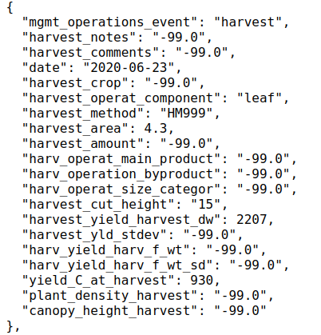
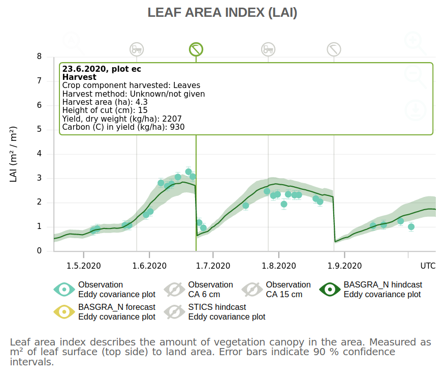

\setlength{\headheight}{63.55022pt}

# Summary

The usability of agro-ecosystem models depends crucially on the availability of input information. Field-level activity data, such as those on timing and methods of planting, tillage, irrigation, fertilization, or harvesting, are crucial as they affect field properties significantly. Farmers work the fields several times in a year. From a modeling point of view, bookkeeping and digesting all the information relating to these events that are relevant for field-level simulations with agro-ecosystem models is highly important. Digital agriculture technology solutions (e.g. tractor mounted sensors) are becoming increasingly available and can track the field events to some extent. However, this type of field management activity information is still difficult to detect automatically, but can easily be reported by humans. Farmers and field operators indeed keep count of field management data electronically and otherwise. However, using this data flow to field monitoring and modeling activities is inefficient and slow (due to the time lag between data collection and availability). Here we present a Shiny application R package which allows farmers to report their field activities through a user-friendly online interface as they occur. Under the hood, the application reformats and harmonizes field activity data in ICASA 2.0 standard format that can be readily utilized in the field monitoring and modeling activities.

# Statement of need

Fieldactivity enables farmers and field operators to fill in field management activity information through a user-friendly interface to aid bookkeeping of such events. There are not many software applications for prompt retrieval of coherent and sufficient field activity data to be utilized in carbon cycle monitoring and modeling of individual fields [@nevalainen2022towards]. Such timely information is a crucial component of measurement/monitoring, reporting and verification (MRV) frameworks where reduced data latency can increase the ability to make near-term ecological forecasts [@dietze2018iterative] and can open up more ways to mitigate climate change [@smith2020measure].

Without rapid, precise and practical information on field management activities, MRV frameworks have limited applicability. Collecting such information is bottlenecked by cumbersome file formats (e.g. spreadsheets that are hard to fill and parse), user errors (e.g. ambiguity in vocabulary and units), as well as lack of automation and machine-accessibility. Fieldactivity provides a structured, human and machine readable solution that increases interoperability and reusability of the field management activity data. Fieldactivity formats and stores the inputted management data in flexible JavaScript Object Notation (json) files which adopt the International Consortium for Agricultural Systems Applications (ICASA) standards [@white2013integrated].

Among the CRAN packages in R, existing agriculture related packages are focused on providing already available datasets (e.g. agridat [@agridat2021]) for deploying a range of statistical analyses (e.g. agriTutorial [@agriTutorial2019] and agricolae [@agricolae2021]). While agricultural applications for data collecting and storing are also available, these have been typically built around a business idea to provide farmers a virtual ecosystem that helps them to manage their farms. Examples of these ecosystems are AGRIVI [@Agrivi2022], Agworld [@Agworld2022] and Conservis [@Conservis2022], which are approaching agricultural bookkeeping from a productivity and profitability point of view. These services are not, however, freely available. On the other hand, there are open software such as FarmOS [@farmOS2022] and Tania [@Taniadev2022], both of which are available to be installed from GitHub and provide an interface for keeping track of farm operations broader than field management events (e.g. list of upcoming tasks or information of assets). While data collected and reported in these applications can also be repurposed for their use in further assessments, these applications are not particularly designed to inform downstream carbon monitoring and modeling activities. Instead, Fieldactivity presents users a curated set of questions which are tailored towards improving field-specific carbon estimations. In return, Fieldactivity also serves as a facilitator for farmer participatory research which is particularly associated with improved soil health and productivity [@mattila2022farmers;@lacoste2022farm].

# The process flow

<!-- Figure \ref{fig:flow} --> 

1) Application Fieldactivity is created by following the Golem framework [@fay2021golem]. It is made to be highly modularised, which helps in the application’s maintenance and development in the future. Detailed information of the application's structure and functionality can be found from the application github pages [@gh-pages2022].

2) The application provides an easy to use interface with two different language options (English and Finnish). Dropdown menus for the site and block/plot names as well as for the topics of the field management events guard against typing errors. Specific information regarding the selected management event in the chosen site is then filled in. The saved management inputs can be verified from the summary of events table that is visible and editable for the user the whole time during which the application is running.

3) Data are initially stored locally, but the application can be integrated to a server. The stored data are separated to different directories based on the given site and block/plot information. However, all of the events for the same site and block are stored into a single stand-alone json file which adopts the ICASA 2.0 standard variable naming convention. The event entries can also be exported from the app as a flat (unformatted) csv file, or as json files.

4) Ecosystem models have their model-specific ways and formats of inputting management events [@fer2021beyond], therefore the produced format would not suit for direct use in all models. However, as Fieldactivity follows a standard data format (ICASA), it provides a clear framework for passing the json files generated by Fieldactivity to the modeling workflows without excessive labor to the modellers.

# Field Observatory use case

Monitored data from carbon farming fields within the Field Observatory Network (FiON) are disseminated via the FieldObservatory website [@FieldObs2022;@nevalainen2022towards]. For the FiON sites, management events are collected through the Fieldactivity app, which is linked from fieldobservatory.org/fieldapp. The stored json files (Fig \ref{fig:management} left panel) are visualized accordingly and used for informing modeling workflows (Fig \ref{fig:management} right panel). 

{width=42%} {width=58%}
\begin{figure}[!h]
\caption{(left) How it is stored: Example of a harvest event in a field management event file adopting the ICASA standards, collected and processed by the fieldactivity app, and shared online https://data.lit.fmi.fi/field-observatory/qvidja/ec/events.json. (right) How it is used: The event information is then marked with specific icons (e.g. scythe icon for harvest) on respective graphs with enabled pop-up windows, and informed modeling workflows for the field (the green continuous polygon representing the predictions for Leaf Area Index variable from a grassland model, BASGRA\_N (Höglind et al., 2020).\label{fig:management}}
\end{figure}

# Acknowledgements

We thank the people who tested the app and gave valuable feedback on how to develop the application further; Annalea Lohila, Juuso Joona, Liisa Kulmala, Åsa Stam, especially to those who participated in the hackathon for entering historical field management events through the fieldactivity app, Tuuli Hakala and Olli Nevalainen, and to the Carbon Action farmers who reported their field activity data. We acknowledge support from The Strategic Research Council (SRC) at the Academy of Finland grant no. 352431, The Ministry of Agriculture and Forestry of Finland grant no. VN/27979/2021 and Business Finland: Project 8391/31/2021 - From Footprints to Digital Handprints - Carbon and greenhouse gas budget of agriculture.

# References
