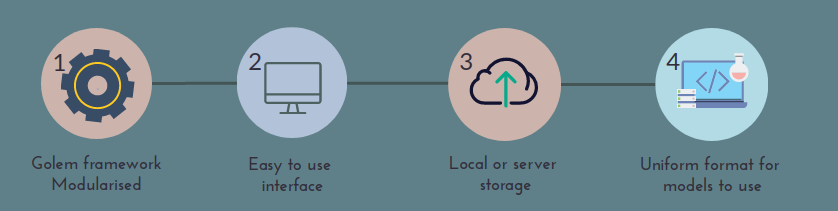
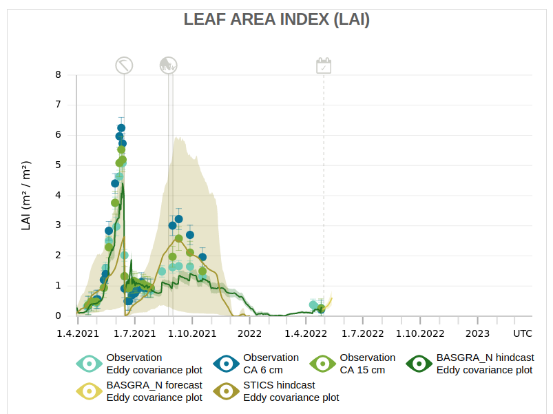
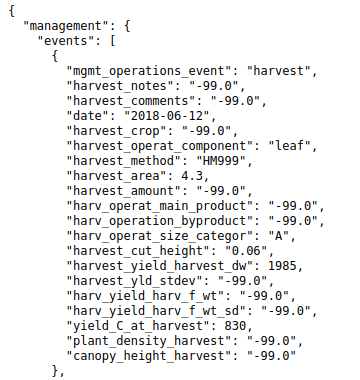

# Summary

The usability of agro-ecosystem models is crucially dependent on the available information that is given as an input to the model. One particular source of uncertainty that affects the applicability of these models is the field level activity (such as the timing and amount of planting, tilling, irrigating, fertilizing, harvesting etc.) which can in practice modify the properties of a field significantly. These actions can be implemented several times in a year per field site. From a modeling point of view, bookkeeping and digesting all the information relating to these events that are relevant for field simulations with agro-ecosystem models is highly important. Digital agriculture technology solutions (e.g. tractor mounted sensors) are becoming increasingly available and can enable tracking to field events to some extent. However, this type of field management activity information is still difficult to detect automatically, but can easily be reported by humans. Farmers and field operators indeed keep count of such field management data electronically and otherwise, however, their flow into field monitoring and modeling activities is not streamlined and is often prone to high latency (time between data collection and availability). Here we present a shiny application R package where farmers can report these activities through a user-friendly online interface as they occur. Under the hood, the application reformats and harmonizes field activity data in a standard format that can be readily utilized in the field monitoring and modeling activities.

# Statement of need

Fieldactivity enables farmers and field operators to fill in field management activity information through a user-friendly interface to aid bookkeeping of such events. There are not many software applications for prompt retrieval of coherent and sufficient field activity data to be utilized in carbon cycle monitoring and modeling of individual fields [@nevalainen2022towards]. Such information is a crucial component of measurement/monitoring, reporting and verification (MRV) frameworks and can open more ways to mitigate climate change [@smith2020measure].

Without precise and practical information on the timing, amount and type of field level management activities, MRV frameworks have limited applicability. Collecting such information is bottlenecked by cumbersome file formats (e.g. hard to fill/process/parse spreadsheets), user errors (e.g. ambiguity in vocabulary and units), as well as lack of automation and machine-friendliness. Fieldactivity provides a structured, human and machine readable solution that increases interoperability and reusability of the field management activity data. To do that, Fieldactivity formats and stores the inputted management data in flexible JavaScript Object Notation (JSON) files which adopts the International Consortium for Agricultural Systems Applications (ICASA) standard vocabulary [@white2013integrated].

Among the CRAN packages in R, existing agricultural related packages are focused on analysing already available datasets e.g. agriTutorial [@agriTutorial2019] and agricolae [@agricolae2021] or providing more information to support different agricultural analyses such as package agridat [@agridat2021]. While agricultural applications for data collecting and storing are also available, these have been typically built around a business idea to provide farmers a virtual ecosystem that helps them to manage their farms. Examples of these ecosystems are AGRIVI [@Agrivi2022], Agworld [@Agworld2022] and Conservis [@Conservis2022], which are approaching agricultural bookkeeping from a productivity and profitability point of view. These services are not, however, freely available. On the other hand, there are open software such as FarmOS [@farmOS2022] and Tania [@Taniadev2022], both of which are available to be installed from GitHub and provide an interface for keeping track of farm operations broader than field management events (e.g. list of upcoming tasks or information of assets). While data collected and reported from these applications can also be repurposed, they are not structured to inform downstream carbon monitoring and modeling activities. Instead, fieldactivity presents users a curated set of questions which are tailored towards improving field specific carbon estimations. In return, fieldactivity also serves as a facilitator for farmer participatory research which is particularly associated with improved soil health and productivity [@mattila2022farmers]. 

# The process flow

Figure \ref{fig:flow} is a brief summary of the fundamentals regarding the application’s structure and the purpose that it serves. The scope of this section is to highlight the application’s main features and provide an idea of the process flow.

1) Application *fieldactivity* is created by following the Golem framework. It is made to be highly modularised, which helps in the application’s maintenance and development in the future. Detailed information of the application's structure and functionality? can be found under the vignettes directory.

2) The application provides an easy to use interface with two different language options (English and Finnish). Dropdown menus for the site and block/plot names as well as for the topics of the field management events guard against typing errors. Specific information regarding the selected management event in the chosen site is then filled in. The saved management inputs can be verified from the summary of events’ table that is visible and editable for the user the whole time during which the application is running.

3) Data are initially stored locally, but the application can be integrated into a server. The stored data are separated to different directories based on the given site and block/plot information. However, all of the events for the same site and block are stored into a single .json-file.

4) Data inputs can differ based on the used ecosystem model, so it might be unavoidable to produce an event template that would suit all the models. Nevertheless, providing the information of field management events in a unanimous way with a sufficient amount of information reduces the excessive labor of modellers.

# Field Observatory

Just a very brief 3-4 sentence explanation how the software is being used in Field Observatory..screenshots of underlying json and visualization on graphs, where both monitoring and modeling are visible (e.g. LAI or CO2flux graph from Qvidja)..cite again Nevalainenetal2022

Data from certain sites are used and plotted in the FieldObservatory website [@FieldObs2022], [@nevalainen2022towards]. For example, in plot \ref{fig:LAI}   from the site named Qvidja, the model behind the graphs has used the .json file that has been generated by using fieldacticity application. Figure \ref{fig:Qvidjaevent} is a screenshot of the aforementioned field management event file.

# Acknowledgements

We want to thank the hackathon participants, who spent several hours entering the field management events in to fieldactivity and gave valuable feedback on how to develop the application further.

# References

